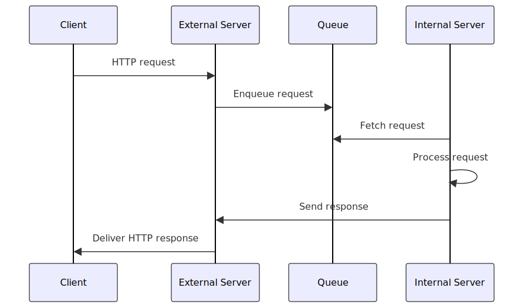

# HttpReverseProxy


HttpReverseProxy is a specialized HTTP-based reverse proxy designed to facilitate secure access to HTTP services located within an internal network from external clients. This project aims to bridge the gap between internal and external networks, ensuring controlled and secure communication.

## Features

- **Secure Access**: Provides secure access to internal HTTP services from external networks.
- **Queue-Based Handling**: Utilizes a queue mechanism to efficiently manage and route requests.
- **Scalability**: Designed to be scalable, handling multiple simultaneous requests efficiently.
- **Logging**: Detailed logging for monitoring and debugging purposes.

## Getting Started

These instructions will get you a copy of the project up and running on your local machine for development and testing purposes.

### Installing

A step-by-step series of examples that tell you how to get a development environment running:

```
$ pip install -r requirements.txt
```

### Usage

Describe how to use the HttpReverseProxy, including any relevant configuration and deployment steps.

In the internal network, run

```
$ python proxy-in.py --port 8081 --server http://127.0.0.1:8080 --external http://external.ip.com
```

and in the external network(eg. external.ip.com), run

```
$ python proxy-out.py --port 80
```

then you can access the internal server via external.ip.com !

## How it works



1. Receiving HTTP Requests: The process begins with the external server receiving HTTP requests from clients. This server acts as the initial contact point for incoming traffic.

2. Queueing Requests: These requests are then queued in a specialized system. The queue serves as a buffer, managing the flow of requests to ensure they are handled efficiently.

3. Processing by Internal Network Server: The internal network server periodically retrieves requests from the queue. This server is part of the protected internal network, isolated from direct external access.

4. Responding to Requests: After processing the requests, the internal server sends the responses back to the queue.

5. Delivering Responses: Finally, responses from the queue are delivered back to the external server, which then relays them to the respective clients.
